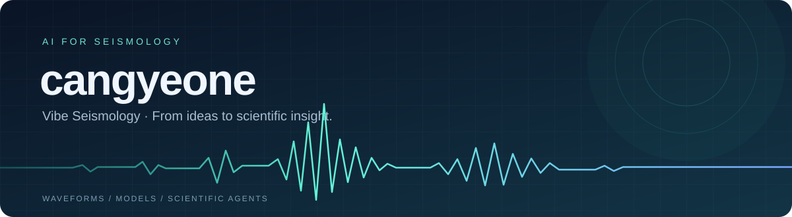

  <strong>English</strong> · <a href="README.zh-CN.md">简体中文</a>

  

  <strong>AI for Seismology · Vibe Seismology</strong> 
  Seismic waveforms · Foundation models · Scientific agents

  <a href="https://github.com/cangyeone/seismicxm">Seismic Foundation Models</a> ·
  <a href="https://github.com/cangyeone/sage">AI for Research</a> ·
  <a href="https://github.com/cangyeone/seismicx-catalog-skill">Automated Cataloging</a> ·
  <a href="https://github.com/cangyeone/rag-tool-agent-course">Courses &amp; Tutorials</a>

## Hi, I'm cangyeone 👋

My focus is **AI for Seismology**: building models, tools, and agents that help us understand seismic signals and carry out earthquake research. I also explore **Vibe Seismology** — working with AI through natural language to turn research ideas into code, analyses, and reproducible workflows.

- **Signals & models**: seismic waveform representations, multitask learning, phase picking, and event identification.
- **Analysis & inversion**: earthquake location, surface-wave dispersion inversion, numerical computing, and GPU acceleration.
- **Vibe Seismology**: natural language interaction, RAG, tool calling, and scientific agents for automated cataloging and reproducible analysis.

## Featured Projects

| Project | What it does |
| :--- | :--- |
| **[SeismicXM](https://github.com/cangyeone/seismicxm)** | A cross-task foundation model for single-station seismic waveforms, supporting phase picking, first-motion polarity classification, and event-type classification. |
| **[SAGE](https://github.com/cangyeone/sage)** | An AI workbench for seismology research that connects natural language interaction, knowledge retrieval, code execution, scientific plotting, and paper writing. |
| **[SeismicX Agent](https://github.com/cangyeone/seismicx-agent)** | A seismic monitoring and analysis platform combining real-time data acquisition, deep learning phase detection, and event association parameter tuning. |
| **[Seismological AI Tools](https://github.com/cangyeone/seismological-ai-tools)** | A collection of AI tools for seismological research. |
| **[CSNBench](https://github.com/cangyeone/csnbench)** | A benchmark comparing seismic phase-picking models in China. |
| **[SeismicX Catalog Skill](https://github.com/cangyeone/seismicx-catalog-skill)** | Tools for AI agents to build earthquake catalogs from continuous seismic waveforms. |

## From Data to Scientific Results

More projects for datasets, location, inversion, and scientific computing:

- **[seis-stream](https://github.com/cangyeone/seis-stream)** — A continuous seismic waveform dataset for benchmarking earthquake monitoring algorithms.
- **[bayes_location](https://github.com/cangyeone/bayes_location)** — Travel-time models, robust Bayesian earthquake location, and catalog quality control.
- **[SurfFlow](https://github.com/cangyeone/SurfFlow)** — Probabilistic surface-wave dispersion inversion using a conditional rectified flow.
- **[grtm_cuda](https://github.com/cangyeone/grtm_cuda)** — GPU-accelerated Green's function computation for layered media.

## Learning & Sharing

I also share resources that connect theory with working code:

- [Quantitative Seismology](https://github.com/cangyeone/QuantitativeSeismology) · Learning materials in Chinese
- [Deep Learning Theory & Practice](https://github.com/cangyeone/deep-learning-theory-and-practice) · [Companion code](https://github.com/cangyeone/deeplearning)
- [Large Language Model Course](https://github.com/cangyeone/llm_tech)
- [RAG, Tool Calling & Agent Development](https://github.com/cangyeone/rag-tool-agent-course)

## Contact & Collaboration

I welcome discussions about AI for Seismology, Vibe Seismology, and research tools. For project-specific questions, please open an issue in the relevant repository. For academic use or commercial collaboration, please review each project's license and usage guidelines.

📬 Email: [yuziye@cea-igp.ac.cn](mailto:yuziye@cea-igp.ac.cn)

  Explore signals. Build models. Make research reproducible.

